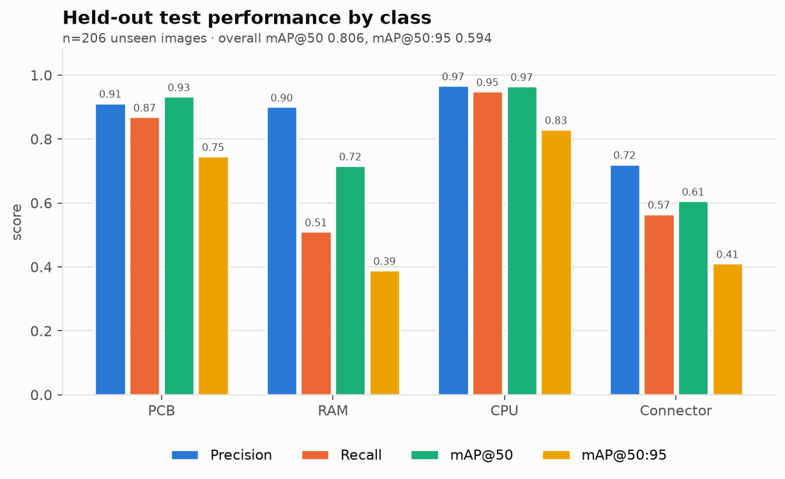
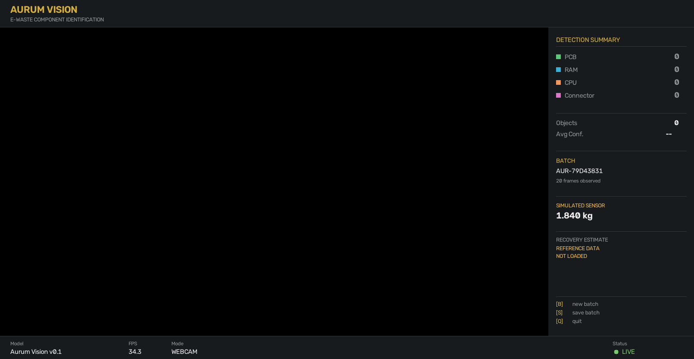

# Aurum

**Computer vision that identifies and counts e-waste components from a webcam,
an image folder or a video, and turns each session into a structured batch
record.**

E-waste changes hands by gross weight, so what is actually inside a board is
invisible at the point of collection. Aurum's vision layer makes it
machine-readable: point a camera at a pile of hardware and get back *what is
there and how much of it*, as JSON the rest of a recycling workflow can use.

    

> **The weights are a release asset, not a tracked file.** `models/*.pt` is
> gitignored, so a fresh clone has no model until you download one. One command
> and a checksum: see
> [Model weights](#model-weights--read-this-before-running-anything).

---

## What it does

```
webcam                                    real camera, real components
        ↓
YOLO11n detector          fine-tuned, 512 px inference, conf 0.35, IoU 0.5
        ↓
ByteTrack + item lifecycle    one physical object -> one AUR-ITEM-xxxxxxxx
        ↓
   [ the operator carries it to the pan ]
        ↓
HX711 load cell           raw counts -> median filter -> stability -> MEASURED
        ↓
material reference        cited composition per component, or an explicit refusal
        ↓
PMDI                      precious mass, and precious fraction in ppm
        ↓
A / B / C decision        configurable policy over that evidence
        ↓
Arduino over USB serial   AURUM/1 MOVE -> ACK
        ↓
Servo A / Servo B         Bin C has no servo, and needs none
```

It identifies **four** component classes, gives each physical object a stable
identity, attaches a measured mass to it, maps it onto an **evidence-backed
material composition reference**, computes a precious-metal fraction, decides a
recovery bin, and drives a real servo.

It does **not** measure precious-metal content directly, estimate material
*recovery*, price anything, or move objects between stages — **there is no
conveyor**, and the operator carries each component from the camera to the load
cell to the bins. See
[What is and is not implemented](#what-is-and-is-not-implemented).

**The honest one-line claim:**

> Aurum demonstrates an intelligent e-waste identification, material estimation
> and automated routing prototype. It validates the perception, measurement,
> material-intelligence and actuator-control pipeline. Mechanical conveying and
> singulation are the next hardware stage.

Not "a fully automated conveyor sorting system". There is no conveyor.

## Running the sorting console

```bash
export AURUM_ARDUINO_PORT=/dev/cu.usbmodem101   # ls /dev/cu.usbmodem*
export AURUM_ARDUINO_ENABLED=true               # actuation ships OFF
uvicorn app.api:app --port 8000

cd frontend && npm install && npm run dev       # http://localhost:5173
```

Start camera → connect board → hold a component up → **Measure & route**. Full
runbook, including what to say and what to do when something fails, in
[docs/demo.md](docs/demo.md).

## Supported components

| Class | What counts as one |
|---|---|
| **PCB** | A whole board as one object — motherboards, expansion cards, bare or populated |
| **RAM** | A memory module — DIMM, SO-DIMM, RDIMM |
| **CPU** | A packaged processor — LGA, PGA or BGA, lid or pin side |
| **Connector** | A mating interface — headers, sockets, slots, edge connectors, rear port banks |

Four classes, not forty. Classes without enough reliable annotation were dropped
rather than shipped weak — including `gpu`, the single largest available label,
because in the source data a GPU is a shrouded card whose camera-facing surface
is a cooler shroud rather than an exposed board. Reasoning in
[docs/dataset.md](docs/dataset.md).

## Results on the held-out test split

206 unseen images, 340 instances, measured at **512 px** — the resolution the
model was trained at, read from the checkpoint rather than passed in.

| Metric | Value |
| --- | ---: |
| Precision | **0.876** |
| Recall | **0.724** |
| mAP@50 | **0.806** |
| mAP@50:95 | **0.594** |

| Class | Instances | Precision | Recall | mAP@50 | mAP@50:95 |
| --- | ---: | ---: | ---: | ---: | ---: |
| CPU | 79 | 0.967 | 0.949 | 0.965 | 0.831 |
| PCB | 69 | 0.913 | 0.870 | 0.933 | 0.746 |
| RAM | 139 | 0.901 | 0.511 | 0.717 | 0.390 |
| Connector | 53 | 0.721 | 0.566 | 0.607 | 0.411 |



Source: `reports/test_metrics.json`, written by `python -m ml.evaluate` straight
from the Ultralytics validator. Nothing here is recomputed or rounded up.

Measured on a split that shares **no duplicate cluster** with training data —
verified: 0 clusters spanning splits, 0 exact duplicates, 0 near-duplicates.

## The generalization gap — read this next to the table above

The test split above shares its **provenance** with training: same Roboflow
projects, same photographers, same benches. To probe whether the model survives
a genuinely different camera, it was run over **27 CC-licensed photographs from
Wikimedia Commons**, verified by perceptual hash to have zero overlap with
training.

**These images have no ground-truth boxes. No accuracy figure can be computed
from them and none is quoted.** What follows is detection behaviour only.

| At the documented threshold (conf 0.35) | |
| --- | ---: |
| Images with at least one detection | **12 of 27 (44%)** |
| PCB detections | 5 |
| RAM detections | 8 |
| CPU detections | **0** |
| Connector detections | **0** |

At a relaxed conf 0.15: detections on **18 of 27**, and **1** CPU.

**CPU scores 0.965 mAP@50 on the held-out test set and detects nothing here.**
A class can sit at the top of a benchmark and still fail outright on
photographs taken by someone else, with different framing, lighting and working
distance. Read the test table as generalization across photographs of the same
kind — not as readiness for a scrap dealer's bench. Closing this gap needs
images collected on a real bench; no threshold tuning substitutes for it.

Run it on your own photos: `python -m ml.realworld --path <folder>`.
Full detail in [docs/evaluation.md](docs/evaluation.md).

## Performance — inference throughput, not pipeline throughput

Every figure below times **`model.predict` only**. Capture, batch aggregation
and rendering are excluded, so these are *not* end-to-end camera FPS. The FPS
readout on the OpenCV dashboard uses the same inference-only definition.

| Measurement | Result |
| --- | ---: |
| Test images at native size, 512 px inference | 19.5 ms mean → **~51 FPS** |
| 1280×720 input, 512 px inference | 12.2 ms mean → **~82 FPS** |
| `AurumDetector.fps` over a 30-frame window | ~52.6 |

Measured on an Apple M4. Note that inference runs on **CPU** by default —
Ultralytics does not select MPS on its own, and `AurumDetector` only passes a
device when one is given. No end-to-end pipeline FPS is currently published,
because none has been measured with an artifact to back it.

## Dataset and the leakage-safe split

Six public [Roboflow Universe](https://universe.roboflow.com) datasets — 17,193
images under **CC BY 4.0** and **Public Domain** — normalized into the four
Aurum classes via an explicit label map where every source label is either
mapped or dropped with a written reason.

The split is the part worth scrutinising. Source datasets ship augmented copies
of one photograph as separate files, and the same photo appears across multiple
projects. Splitting at random would put rotations of the same RAM module in both
train and test. So images are grouped into **duplicate clusters** (source stem,
then SHA-256 and perceptual hash across datasets) and **clusters, not images,
are split 70/20/10**.

**Two cluster counts appear in the reports, and they measure different things:**

| Number | Meaning | Source |
| ---: | --- | --- |
| **4,353** | clusters *formed* over all 17,193 ingested images | `reports/dataset_stats.json` |
| **2,154** | clusters that *survive into the built dataset* after background capping and held-out pruning | `reports/dataset_validation.json` |

**Why 17,193 images become 5,496.** Two filters run after the split: 8,464
images carry no label that survives the label map, and 3,233 augmented copies
are removed from the held-out splits so no test image is a rotation of another
test image. What is left is **4,878 train / 412 valid / 206 test**. The held-out
splits are small on purpose — they count distinct photographed scenes, which is
the only thing worth measuring on.

`python -m ml.validate` re-checks all of this independently and exits non-zero
if any photograph reaches the test set from training. It is not decoration — it
caught 18 near-duplicates the first version of the grouping code missed.

Per-dataset counts, licenses and attributions: [docs/dataset.md](docs/dataset.md).

## Model weights — read this before running anything

`models/*.pt` is gitignored — the weights are **not** in Git history. They are
published as a release asset, identified by digest so the metrics above are
bound to one exact file rather than to a filename.

| | |
|---|---|
| Release | [`model-v0.1`](https://github.com/parth-sharma-10/aurum/releases/tag/model-v0.1) |
| Asset | `aurum_vision_v0_1_best.pt` |
| SHA-256 | `cd1a3c2cd2c99c1ff5315c073f01fd236767b4425ee5d99598e6f8fedee312e9` |
| Size | 5,454,554 bytes |
| Model version | Aurum Vision v0.1 |

### Download and verify

```bash
mkdir -p models
curl -L -o models/aurum_vision_v0_1_best.pt \
  https://github.com/parth-sharma-10/aurum/releases/download/model-v0.1/aurum_vision_v0_1_best.pt

shasum -a 256 models/aurum_vision_v0_1_best.pt
# cd1a3c2cd2c99c1ff5315c073f01fd236767b4425ee5d99598e6f8fedee312e9
```

The same digest is recorded in `models/aurum_vision_v0_1_meta.json` under
`artifact.sha256` and in `docs/model-card.md`. If your download disagrees with
those, the file is not the model the reports describe — do not use it.

Then run anything:

```bash
python run_demo.py --mode images --path <a folder of photos>
python -m uvicorn app.api:app --reload
```

### Or rebuild it from scratch

`ml/train.py`'s defaults **are** the release configuration (50 epochs / 512 px /
batch 32 / patience 15 / seed 1337), so no flags are needed and a rebuild
targets the same model the published metrics describe:

```bash
cp env.example .env                # add your free Roboflow API key
export ROBOFLOW_API_KEY="..."
python -m ml.ingest                # download the 6 source datasets
python -m ml.prepare               # normalize, deduplicate, split
python -m ml.validate              # prove the split is leak-free (gates training)
python -m ml.train                 # ~3 h on an Apple M4
python -m ml.evaluate
```

A retrained model will not be byte-identical — GPU non-determinism sees to that
— so `ml/train.py` records the digest of whatever it produced into
`models/aurum_vision_v0_1_meta.json`. Compare your `reports/test_metrics.json`
against the published one rather than expecting the same hash.

Inference resolution is read from the checkpoint, so a model trained at another
size will infer at that size rather than silently at 640.

## Installation

Prerequisites: **Python 3.12** (PyTorch has no stable 3.14 wheels), a webcam for
the live demo, ~1 GB disk to rebuild the dataset, and **Node 20.19+ or 22.12+** (what Vite 7
requires) for the web dashboard.

```bash
git clone https://github.com/parth-sharma-10/aurum.git
cd aurum

python3.12 -m venv .venv
source .venv/bin/activate          # Windows: .venv\Scripts\activate
pip install -r requirements.txt
```

No environment variable is needed to *run* against existing weights.
`env.example` documents every variable; copy it to `.env` (gitignored) if you
prefer a file.

macOS: grant your terminal camera permission in **System Settings → Privacy &
Security → Camera** before the first webcam run. Without it the camera reports
itself open and never delivers a frame; the demo detects exactly that and falls
back to image mode rather than exiting.

## The OpenCV demo

```bash
python run_demo.py                                        # webcam
python run_demo.py --mode images --path data/aurum/test/images
python run_demo.py --mode video  --path clip.mp4
```



Camera feed with boxes on the left; per-class counts, object total, mean
confidence, batch ID and mass on the right; model version, inference FPS and
status along the bottom. If no load cell is attached the mass panel reads
**SIMULATED SENSOR**.

Keys: `B` new batch · `S` save batch · `SPACE` pause · `←`/`→` (or `,`/`.`)
step images · `Q` quit

Useful flags: `--conf` (default 0.35), `--iou` (0.5), `--window` (45),
`--imgsz` (defaults to the checkpoint's), `--weight-mode`
(`auto|hx711|simulated|off`), `--no-window --frames N` for headless.

Presentation runbook, including failure recovery: [docs/demo.md](docs/demo.md).

## How a batch is composed

Per-frame detection flickers — a module drops out for two frames when a hand
crosses it. If the record used whatever the last frame said, it would be a
function of *when the operator clicked*. So `BatchSession` keeps a trailing
window of **45 frames** (~1.5 s at 30 fps) and the count for each class is the
**median** over that window. The median ignores brief dropouts and brief
double-counts without inventing anything.

A batch **closes** when the operator presses `S` in the demo, or when
`POST /batch/{id}/close` is called. In image mode the window is cleared whenever
the file changes, because a median across unrelated photographs is meaningless.

```json
{
  "batch_id": "AUR-48442B02",
  "detections": { "PCB": 0, "RAM": 0, "CPU": 1, "Connector": 0 },
  "total_objects": 1,
  "average_confidence": 0.8823,
  "frames_observed": 1,
  "counting_method": "median per-class count over a trailing 45-frame window",
  "started_at": "2026-08-16T18:17:42+00:00",
  "timestamp": "2026-08-16T18:17:42+00:00",
  "model_version": "Aurum Vision v0.1",
  "source": "api",
  "weight": { "grams": 1840.0, "kg": 1.84, "simulated": true,
              "source": "simulated load cell",
              "warning": "SIMULATED SENSOR — not a physical measurement" },
  "recovery_estimate": { "available": false, "reason": "Estimation is blocked because not every detected component has usable cited data. …" }
}
```

`recovery_estimate` is `available: false` above because the batch contains a
**RAM** module, and RAM has no cited composition figure — so the whole estimate
refuses rather than reporting a total that quietly omits it. A batch of CPUs and
connectors does produce a figure:

```json
{
  "available": true,
  "kind": "ESTIMATE",
  "detected_components": { "PCB": 0, "RAM": 0, "CPU": 1, "Connector": 2 },
  "material_estimate": {
    "Au": { "typical_g": 0.006538, "min_g": null, "max_g": null,
            "evidence": ["CONN-AU-001", "CONN-AU-002", "CPU-AU-001"],
            "bounds_note": "A bound is null where at least one contributing component has no cited bound." }
  },
  "components": [
    { "component": "CPU", "subtype": "bga_pga_package", "count": 1, "metal": "Au",
      "per_unit": 4.71, "per_unit_unit": "mg", "unit": "g", "total": 0.00471,
      "calculation": "1 x 4.71 mg per piece", "evidence": ["CPU-AU-001"],
      "confidence": "medium",
      "source": "[CPU-AU-001] Firsching et al. (2024). X-ray transmission imaging of waste printed circuit boards… 10.1177/0734242X241257084" }
  ],
  "confidence": "medium",
  "recovery": { "available": false, "reason": "No cited recovery factor applies to a whole detected component. …",
                "cited_factors_on_file": ["CONN-AU-REC-001", "CONN-AU-REC-002", "CONN-AU-REC-003"] },
  "measured_material": { "available": false, "reason": "Aurum does not measure material content. …" },
  "disclaimer": "ESTIMATE ONLY — …"
}
```

## Persistence — two separate paths

This is worth being explicit about, because the two do not currently meet:

| Path | Writes JSON to `data/batches/` | Writes the SQLite ledger |
|---|---|---|
| OpenCV demo (`S` key, or `--no-window`) | **yes** | **yes** |
| API (`POST /batch/{id}/close`) | **yes** | **yes** |

Both go through the single `save()` in `app/ledger.py` — there is one `INSERT`
in the codebase, and a test fails if a second appears. A batch saved on stage
shows up in `/batches`, `/stats` and the browser dashboard within one poll.

If the ledger write fails (a locked database, say) the demo prints a warning and
keeps going: the JSON is already on disk, and a persistence hiccup should not
end a presentation.

The `batches` table is flat — `batch_id`, `created_at` (the *close* timestamp),
`model_version`, `total_objects`, `avg_confidence`, `weight_grams`,
`weight_simulated` — plus `record_json` holding the complete record, so nothing
is lost to the flattening.

## HTTP API

```bash
python -m uvicorn app.api:app --reload      # interactive docs at /docs
```

| Method | Path | Semantics |
| --- | --- | --- |
| `GET` | `/health` | `status` is `ok` or `model_missing`; returns model version, classes, weights path. Never 503s |
| `GET` | `/model` | Training metadata as recorded at training time, plus `reports/test_metrics.json` if present, plus the no-composition disclaimer |
| `POST` | `/detect` | multipart `file`; returns detections (class, confidence, `box_xyxy`), counts for **every** class, `total_objects`, `average_confidence`, `inference_ms` |
| `POST` | `/detect/annotated` | Same input; returns the drawn JPEG |
| `POST` | `/batch/start` | Opens an in-memory session; returns `batch_id` and `started_at` |
| `POST` | `/batch/{id}/frame` | multipart `file`; adds one observed frame; returns this frame's counts and the running `stable_counts` |
| `POST` | `/batch/{id}/close` | Finalizes, writes JSON **and** SQLite, returns the record. Optional `?weight_mode=simulated\|hx711\|off` (default `off`) and `?hx711_port=` |
| `GET` | `/batches` | Stored records, newest first, `?limit=` (default 50) |
| `GET` | `/batches/{id}` | One stored record |
| `GET` | `/stats` | Ledger aggregates, computed in SQL |
| `GET` | `/batches/{id}/valuation` | Estimated value of a stored batch, priced at request time. **Currently always unavailable** — see below |

Unknown batch ids return **404**; empty or undecodable uploads return **400**;
every endpoint that needs the model returns **503** when weights are absent.

```bash
curl -X POST localhost:8000/batch/start                      # -> {"batch_id": "AUR-..."}
curl -F "file=@board.jpg" localhost:8000/batch/AUR-.../frame
curl -X POST "localhost:8000/batch/AUR-.../close?weight_mode=simulated"
```

### `/stats`

```json
{
  "batch_count": 3,
  "total_count": 3,
  "total_weight": {
    "measured_grams": 0.0,
    "simulated_grams": 3680.0,
    "batches_with_weight": 2,
    "note": "Simulated grams come from a labelled stand-in for the HX711 load cell and are not physical measurements."
  },
  "component_breakdown": { "CPU": 3, "RAM": 0, "PCB": 0, "Connector": 0 },
  "bin_breakdown": {},
  "bin_breakdown_note": "Aurum does not implement physical bin routing or servo actuation. …"
}
```

Two deliberate properties:

- **Mass is never one number.** `measured_grams` and `simulated_grams` are
  separate fields, because summing them would produce a figure that reads as
  measured. Only a record that explicitly stored `weight_simulated = 0` counts
  as measured, so missing provenance falls to the cautious side.
- **`bin_breakdown` is empty by fact, not omission.** Aurum has no bin routing
  and no actuator, so no record carries a bin assignment.

Aggregation is three SQL statements (`COUNT`/`SUM`, a `GROUP BY` on the
simulated flag, and `json_each` over the stored record for per-class counts).
No row is deserialized in Python to add up integers.

## React dashboard

A small browser view of the ledger, in `frontend/`. React 19 + Vite 7 and
nothing else — no UI kit, no chart library, no state manager.

```bash
# terminal 1 — backend must be running first
python -m uvicorn app.api:app --reload

# terminal 2
cd frontend
npm install
npm run dev            # http://localhost:5173
```

It shows aggregate metrics from `/stats`, a ledger table from `/batches`, and
the complete stored record for any batch you select. It **polls every 5
seconds**; there is no websocket.

**It is not a live camera view.** There is no video stream, no live detection
overlay and no control over the detector. It visualizes **closed batch records
that reached the SQLite ledger through the API** — which, per
[Persistence](#persistence--two-separate-paths), excludes anything saved from
the OpenCV demo. Simulated mass is badged `SIMULATED` everywhere it appears and
is never added to measured mass.

Point it at a different backend with `VITE_AURUM_API=http://host:port npm run dev`.
`npm run build` emits a static bundle to `frontend/dist/` (gitignored).

### CORS

The API allows exactly two origins — `http://localhost:5173` and
`http://127.0.0.1:5173` — for **`GET` only**, without credentials. This is a
development policy for the Vite dev server, deliberately not a wildcard: the API
has no authentication, so `allow_origins=["*"]` would let any page a developer
visits read their local ledger. Vite is pinned to 5173 (`strictPort`); change
both sides together.

## Prototype constraints

Not production-ready, and specifically:

- **No authentication.** Any client that can reach the port can read and write.
- **No upload size limit** on `/detect` and `/batch/{id}/frame`.
- **Batch sessions are in-memory and process-local.** An open batch lives in a
  dict in one process: it is lost on restart, it never expires, and **more than
  one uvicorn worker is not safe** — a frame can land on a worker that has never
  heard of the batch. Only *closed* batches are durable.
- **CORS is scoped to localhost Vite origins** and nothing else.
- No rate limiting, no request logging, no TLS.

## Weight: simulated versus measured

Mass is optional and always labelled. With no load cell attached,
`SimulatedLoadCell` produces a drifting value that is flagged
`"simulated": true`, carries `"warning": "SIMULATED SENSOR — not a physical
measurement"`, renders as **SIMULATED SENSOR** in the OpenCV dashboard, badges
`SIMULATED` in the React dashboard, and lands in `simulated_grams` in `/stats`.

The measurement path (`WeightSensor`) has been run against real hardware: an
Arduino streams raw HX711 counts, Python owns the calibration, and a reading
only becomes `MEASURED` on a factor verified against a *second* known mass.

**The load cell is currently mechanically bypassed.** 180 g moves it 2.2 counts
against a 64-count noise floor; 400 g moves it backwards. The cell converts
correctly and sees no strain, so `configs/calibration.yaml` stays `UNMEASURED`
and no reading can reach `MEASURED`. Measurements and the mounting fix are in
[docs/hardware.md](docs/hardware.md).

### The mock-mass fallback

`demo.mock_mass.enabled` ships **off**. With it on, an item that cannot be
weighed is given a per-class stand-in — **CPU 25 g · PCB 180 g · RAM 30 g ·
Connector 5 g** — so the pipeline can still be demonstrated. Per class, because
a precious fraction is metal over *total* mass, and one flat value made a CPU
read 26 ppm where 188 is right.

The number is fabricated and everything says so: the reading is `SIMULATED` and
never `usable`, PMDI and valuation carry `overall_status: SIMULATED`, the metals
table says *assumed* rather than *measured* batch mass, and the console shows a
`MOCK MASS` pill and a banner listing the assumed values. The permission rides
on the reading itself, so an unmarked simulated mass is still refused.

It does not conjure evidence: RAM still reaches Bin C, because no cited
composition exists for a DRAM module and a stand-in mass cannot invent one.

## Material Reference Database

Three different things happen in this repository and conflating any two of them
produces a false claim, so they are named separately everywhere:

| Layer | What it does | Where the truth comes from |
| --- | --- | --- |
| **Computer vision** | identifies and counts components | the image — the only thing Aurum *measures* |
| **Material composition** | maps a class to how much metal it carries | published papers, cited per figure |
| **Recovery estimation** | how much of that metal a process gets out | published papers — **and currently unavailable** |

The vision model **cannot determine composition or purity from an image**, and
nothing in this section changes that. A camera detection of `Connector` does not
prove *gold-plated connector*. What the material layer adds is a reference
estimate for the class:

```
Detected component:   Connector
Reference composition: based on cited literature for the connector category
This is an estimate, not a chemical assay.
```

### The chain

```
detected components   ← the only measured thing here
      ↓  × cited reference composition   (configs/material_reference.yaml)
estimated material present    ← ESTIMATE
      ↓  × recovery factor, ONLY IF CITED AND APPLICABLE
estimated recoverable material ← currently refused, see below
      ↓  × price per unit                (configs/price_reference.yaml)
estimated value       ← ESTIMATE of an ESTIMATE
```

### Coverage, and where it stops

| Class | Metals | Works without a scale? | Status |
| --- | --- | :-: | --- |
| **CPU** | Au | yes | usable — 4.71 mg Au/piece |
| **Connector** | Au (+ Ag, Cu, Ni, Al for gold fingers) | yes | usable — 0.914 mg Au/piece, upper bound 2.35 |
| **PCB** | Au, Ag, Pd, Cu, Ni, Sn, Al | no | needs a **measured** batch mass |
| **RAM** | — | — | **no data — estimate refuses** |

Two evidence shapes exist and they are not interchangeable. **Per-piece** figures
(mg of metal in one component) multiply the count directly. **Concentration**
figures (mg/kg) need a mass first — and Aurum will only use a *measured* one:
multiplying the simulated load cell's invented mass by a real concentration would
produce an invented quantity that reads as measured. A mixed batch is refused
too, because its total mass cannot be attributed to one class.

### It fails closed

A detected class with no cited figure blocks the **whole** estimate rather than
contributing a silent zero, because a total that quietly omits a component still
reads as a total. Since RAM has no data, any batch containing RAM returns:

```json
{ "available": false,
  "reason": "Estimation is blocked because not every detected component has usable cited data. RAM has no cited composition data: …" }
```

No numeric field appears at all in a refusal — there is nothing a UI could
mistake for a figure.

### Composition is not recovery

A paper reporting `6434 mg/kg Au` in gold fingers does **not** say that gold is
recoverable. The database keeps the two in separate sections and never derives
one from the other.

**No recovery factor is applied anywhere in the shipped database.** Three real,
cited factors are on file — all from Lin et al. (2023) — and all three are marked
`applies_to_detection: false`, because they were measured on a feed that had been
stamp-sheared off RAM modules and then chemically decopperized. A connector on a
bench has had neither step done to it.

Those same three numbers are the best argument for refusing: on one identical
feed and reagent system, gold recovery runs **12.7 %** untreated → **88.7 %**
after a copper pre-leach → **98 %** optimised. Any single "industry-standard
recovery rate" applied to a camera detection would be picking one point off that
curve for no stated reason. The factors stay visible in the record under
`cited_factors_on_file`: refusing to apply a figure is not the same as hiding it.

### Every number is traceable

```
Aurum estimate  →  evidence id  →  configs/material_reference.yaml
                →  source id    →  docs/sources/material_sources.yaml
                →  DOI          →  the paper  →  the original table
```

Worked example:

```
Aurum reports    Connector ×3 → Au typical 0.002742 g
evidence         CONN-AU-001, CONN-AU-002
record           value: 0.914, unit: mg, quantity: per_piece
source           FIRSCHING2024 → DOI 10.1177/0734242X241257084
original text    "just one general connector class (C) with 0.914 mg of gold
                  per piece and the sub-class 'high-grade connectors' (Chg)
                  with 2.35 mg"
arithmetic       3 × 0.914 mg = 2.742 mg = 0.002742 g
```

Original units are preserved on every record (`original_value`/`original_unit`),
and `tests/test_materials.py` recomputes every conversion — `1 mg/kg = 1 ppm =
1 g/tonne`, `1 % = 10 000 mg/kg` — so a transcription slip fails CI.

Full methodology, uncertainty and limitations:
**[docs/material-reference.md](docs/material-reference.md)**.

## Material Composition References

Every source that supplies a number was opened and its tables read. Search-result
snippets were never used as evidence. Commercial scrap-trade pages
(ScrapMonster, Alibaba buying guides, refiner price lists) were used as discovery
aids only and supply **no** value in this database.

### PCB

**Characterization of Printed Circuit Boards for Metal and Energy Recovery after Milling and Mechanical Separation**

Authors: Waldir A. Bizzo, Renata A. Figueiredo, Valdelis F. de Andrade
Year: 2014
Journal: *Materials* 7(6):4555–4566
DOI: [10.3390/ma7064555](https://doi.org/10.3390/ma7064555)

Used by Aurum for:
- PCB gold concentration (`PCB-AU-001`, 142 mg/kg)
- PCB silver concentration (`PCB-AG-001`, 317 mg/kg)
- PCB copper, nickel and tin concentration (`PCB-CU-001`, `PCB-NI-001`, `PCB-SN-001`)

Evidence type:
Direct experimental characterization of ~12 kg of waste desktop-computer boards
(XT, 486, Pentium), aqua regia digestion, AAS and ICP. **Caveat:** an early
board generation, not representative of modern boards.

---

**Gravity and Electrostatic Separation for Recovering Metals from Obsolete Printed Circuit Board**

Authors: Camila Mori de Oliveira, Rossana Bellopede, Alice Tori, Giovanna Zanetti, Paola Marini
Year: 2022
Journal: *Materials* 15(5):1874
DOI: [10.3390/ma15051874](https://doi.org/10.3390/ma15051874)

Used by Aurum for:
- Generic waste-PCB ranges for Au, Ag, Pd, Cu, Ni, Sn, Al (`PCB-AU-002` … `PCB-AL-001`)
- One reference server-board mass (`PCB-MASS-001`)

Evidence type:
The authors' whole-board weighted average **with standard deviation**, aggregated
across prior studies — hence `medium` confidence. The paper's own ICP-OES numbers
are measured on separated size fractions (process concentrates, Cu 56–80 %) and
are deliberately **not** used as board composition.

### CPU and Connector

**X-ray transmission imaging of waste printed circuit boards for value estimation in recycling using machine learning**

Authors: Markus Firsching, Moritz Ottenweller, Johannes Leisner, Steffen Rüger
Year: 2024
Journal: *Waste Management & Research* 42(9)
DOI: [10.1177/0734242X241257084](https://doi.org/10.1177/0734242X241257084)

Used by Aurum for:
- CPU gold content per piece (`CPU-AU-001`, 4.71 mg)
- Connector gold content per piece (`CONN-AU-001`, 0.914 mg)
- High-grade connector gold content per piece (`CONN-AU-002`, 2.35 mg)

Evidence type:
ICP-OES on components dismantled from 104 waste PCBs from PCs, servers and mobile
phones. The only source found reporting gold as **mass per component piece** —
the unit Aurum's counts actually need. Reported as means with no standard
deviation and no disclosed sample count, so confidence is capped at `medium`.
The source class is a *package geometry* (BGA/PGA), not "CPU" specifically.

### Connector — gold fingers

**Investigation of the Bimodal Leaching Response of RAM Chip Gold Fingers in Ammonia Thiosulfate Solution**

Authors: Peijia Lin, Zulqarnain Ahmad Ali, Joshua Werner
Year: 2023
Journal: *Materials* 16(14):4940
DOI: [10.3390/ma16144940](https://doi.org/10.3390/ma16144940)

Used by Aurum for:
- Gold-finger gold concentration (`CONN-AU-003`, 6434 mg/kg)
- Gold-finger silver, copper, nickel, aluminium (`CONN-AG-001`, `CONN-CU-001`, `CONN-NI-001`, `CONN-AL-001`)
- The three cited gold **recovery** rates (`CONN-AU-REC-001/002/003`) — recorded, none applied

Evidence type:
Direct chemical assay by roasting and acid digestion, 0.5 g per sample, on
gold-finger edges stamp-sheared from waste RAM modules. **Caveat:** this
describes a liberated contact strip, not a whole connector and not a whole RAM
module; the strip mass is unreported, so it cannot become mg per detected piece.

### RAM

**Impregnated Polymeric Sorbent for the Removal of Noble Metal Ions from Model Chloride Solutions and the RAM Module**

Authors: Karolina Zinkowska, Zbigniew Hubicki, Grzegorz Wójcik
Year: 2024
Journal: *Materials* 17(6):1234
DOI: [10.3390/ma17061234](https://doi.org/10.3390/ma17061234)

Used by Aurum for:
- The mass of one spent RAM module (`RAM-MASS-001`, 7.8040 g) — **and nothing else**

Evidence type:
A single weighed module. The paper's ICP-OES figures are concentrations in an
HCl/H₂O₂ **leachate** (mg/L), not solid composition, so no composition value is
taken from it.

---

**An investigation of trends in precious metal and copper content of RAM modules in WEEE: Implications for long term recycling potential**

Authors: Rhys Charles, Peter Douglas, Ingrid Liv Hallin, Ian Matthews, Gareth Liversage
Year: 2017
Journal: *Waste Management* 60:505–520
DOI: [10.1016/j.wasman.2016.11.018](https://doi.org/10.1016/j.wasman.2016.11.018)

Used by Aurum for:
- **Nothing numeric.** Cited as a documented limitation only.

Evidence type:
AAS on DRAM modules placed on the market 1991–2008 — the most directly relevant
study found for whole RAM modules. It is nominally CC-BY, but every route to the
full text was blocked while this database was built, so **its tables were never
read and no number was taken from it**. Its abstract was verified and supports
only qualitative claims: stable gold and silver over time, an 80 % fall in
palladium across 1991–2008, and a 0.23 g/module/year rise in copper. This is why
RAM has no composition figure, and why the estimate refuses on any batch
containing RAM.

## Valuation — still disabled, and why

Valuation is the layer past recovery, and it remains off:

`configs/price_reference.yaml` **ships empty and disabled**, so
`/batches/{id}/valuation` returns an explicit refusal. Enabling it requires
prices with a real source and timestamp. A spot price with no source and no
timestamp is worse than no price: it gets screenshotted and outlives the
conversation that qualified it.

Composition data and market prices are deliberately different layers — no metal
price is hardcoded into the material database:

```
material reference database  →  Au / Ag / Pd / Cu grams
                             →  market price service
                             →  gross material value
```

Valuation is computed at request time, never stored on the record: a metal price
is time-varying external data, so baking one into a batch would make the record
silently wrong the next day. Each priced line carries the quote's material, unit,
currency, timestamp and source, plus a `calculation_version`.

`app/pricing.py` refuses rather than guesses — no provider, a material it cannot
quote, a unit mismatch (grams priced per troy ounce would be wrong by 31× and
look plausible), or mixed currencies all produce `available: false`.

**Live prices are not implemented.** The `PriceProvider` protocol exists and the
shipped implementation reads a pinned snapshot from configuration; nothing polls
a market feed.

Every batch record names these quantities so they cannot be confused:

| Field | Meaning |
|---|---|
| `detected_components` | what the model counted — measured, by the model |
| `components[].total` | count × cited reference composition — an **estimate** |
| `material_estimate` | the same, aggregated per metal, with bounds where cited |
| `recovery` | kept separate; **unavailable**, with a reason |
| `measured_material` | **always unavailable.** Aurum has no assay or XRF |

**PMDI is implemented.** Its formula comes from the Aurum concept document, §4:
`PMDI = (Sigma (C_type x Y_estimated)) x P_spot`. Two things about it are worth
knowing before reading a result.

Its units are currency, not a density — nothing in it is divided by mass — so
Aurum reports the concept document's figure as `pmdi_value` and the true
density separately as `precious_mass_fraction_ppm`. Only the second works
without a price, and **no live price provider is approved for this project**, so
`pmdi_value` is `UNAVAILABLE` in the shipped configuration rather than a number
nobody can attribute.

`Y_estimated` is called a *yield* in the formula. Aurum holds *contained
composition* and never renames one into the other; every amount is labelled
`basis: contained`. See [docs/pmdi.md](docs/pmdi.md).

## Architecture

```
Aurum
│
├── Vision Layer
│   └── YOLO11n
│       ├── PCB
│       ├── RAM
│       ├── CPU
│       └── Connector
│
├── Batch Layer
│   ├── median-window counting
│   ├── weight (HX711 or labelled simulation)
│   └── SQLite ledger
│
├── Material Reference Layer          configs/material_reference.yaml
│   ├── Au · Ag · Pd · Cu · Ni · Sn · Al
│   ├── Pt — no source found, absent by fact
│   └── per-piece vs concentration, fail-closed
│
├── Evidence Layer                    docs/sources/material_sources.yaml
│   ├── peer-reviewed studies
│   ├── DOI + URL per source
│   ├── evidence ids, unique and referenced
│   └── provenance: original value, unit, method, sample
│
├── Valuation Layer                   app/valuation/
│   ├── composition estimate          implemented
│   ├── PMDI (precious signal)        implemented — value needs a price
│   ├── precious mass fraction (ppm)  implemented — price-independent
│   ├── base-metal signal             implemented, kept separate from PMDI
│   ├── recovery estimate             refused — no applicable cited factor
│   ├── market prices                 no approved provider — PRICE_UNAVAILABLE
│   └── estimated value               unavailable until a provider is configured
│
└── Decision Policy                   app/decision/
    ├── PMDI is an INPUT to A/B/C, never the same thing
    ├── 7-step ladder, never short-circuited by a strong signal
    ├── 14 machine-readable reason codes
    ├── thresholds from configs/grading.yaml, all approximations
    └── Bin C has no servo — the fail-safe is the machine doing nothing
```

## Project status

**Aurum is a working software pipeline driving real hardware.** Both servos have
been moved by Aurum's own command over a real serial link, and watched doing it.
The load cell is mechanically bypassed, so no mass has ever been measured. There
is no conveyor, and the operator carries components between stages.

| Phase | Status | Software | Hardware | Validation |
|---|---|---|---|---|
| 0 Checkpoint | COMPLETE | repo protected, research committed | n/a | n/a |
| 1 Configuration | COMPLETE | `app/config.py`, 35 settings | n/a | software-tested |
| 2 PMDI + pricing | COMPLETE | `app/valuation/` | n/a | software-tested; **no price provider** |
| 3 A/B/C decision | COMPLETE | `app/decision/` | n/a | software-tested |
| 4 Tracking | COMPLETE | `app/vision/`, `app/pipeline/` | camera | software-tested + real model |
| 5 HX711 | COMPLETE (software) | `app/weight.py`, `app/calibrate.py` | HX711 responds | **calibration NOT verified** |
| 6 Routing | COMPLETE (software) | `app/routing/` | none | simulation-verified only |
| 7 Arduino/servo | COMPLETE | transport, command layer, both sketches | **both servos moved by Aurum code** | **PHYSICALLY VERIFIED** |
| 8 API/frontend | COMPLETE | session API + sorting console | real webcam | verified in the browser |
| 9 End-to-end | COMPLETE | `app/pipeline/session.py` | camera + board | camera→item→PMDI→bin→servo, on hardware |
| 10 Validation | PARTIAL | 836 tests, ruff clean | — | **calibration blocked on the mounting fault** |

### What the five levels mean

`SOFTWARE-TESTED` · `SIMULATION-VERIFIED` · `HARDWARE-BENCH-VERIFIED` ·
`PHYSICALLY-CALIBRATED` · `PHYSICAL-CONVEYOR-VALIDATED`

The actuation path reaches **level 3** — both paddles moved by Aurum's command
and watched. **Level 4 is not reached**: the load cell is mechanically bypassed,
so nothing has been physically calibrated. Level 5 needs a conveyor, which does
not exist and is out of scope for this demonstration.

### Hardware, as built

HX711 `DOUT`→D2, `SCK`→D3 · Servo A→D9 · Servo B→D10 · serial **115200** (config and sketch now agree) ·
Servo A and B: REST 0 deg, PUSH 90 deg, 700 ms hold (bench values) ·
AKSHA 5 V / 3 A external servo supply, common ground, **external +5 V NOT tied
to Arduino +5 V** · **no physical conveyor**.

Verified on the bench 2026-08-22: both sketches flashed, `W,1,…,OK` frames
streaming, `PING`→`PONG` over the real port, Servo A acknowledged in 709 ms and
Servo B acknowledged, a replayed command id answered `ACK … DUP` without moving
anything twice, and Bin C wrote no bytes at all.

**Not verified: the load cell under load.** It is mechanically bypassed, so
`configs/calibration.yaml` stays UNMEASURED and no reading can reach `MEASURED`.

**Close the Arduino IDE Serial Monitor before flashing or running.** It
reopens itself whenever the board enumerates and holds the port exclusively.

Full detail: [docs/hardware.md](docs/hardware.md) ·
[docs/COMPLETION_PLAN.md](docs/COMPLETION_PLAN.md)

## What is and is not implemented

| Capability | Status |
|---|---|
| YOLO11n detection (PCB / RAM / CPU / Connector) | **implemented** |
| Webcam, image-folder and video inference | **implemented** |
| Median-window batch aggregation | **implemented** |
| Batch records as JSON | **implemented** |
| SQLite ledger | **implemented — via the API only** |
| FastAPI service (10 endpoints) | **implemented** |
| OpenCV dashboard | **implemented** |
| React dashboard (closed batches) | **implemented** |
| Leakage-safe dataset split + independent validator | **implemented** |
| External-image evaluation (no ground truth) | **implemented** |
| Simulated load cell | **implemented, labelled** |
| HX711 measurement path (filter, stability, states) | **implemented** — run against the real board |
| Two-mass calibration workflow (`python -m app.calibrate`) | **implemented** — run on hardware; fails on the mounting fault |
| Weight-only Arduino sketch | **implemented** — flashed and verified at 115200 |
| HX711 calibration factor | **UNMEASURED** — bench evidence exists, calibration does not |
| Combined weight + servo sketch (`aurum_sorter`) | **implemented** — flashed and verified |
| Servo actuation from a decision | **implemented — PHYSICALLY VERIFIED**, both paddles |
| Material composition reference (22 cited records, 6 papers) | **implemented** |
| Material estimation — CPU, Connector | **implemented** — per-piece figures, no scale needed |
| Material estimation — PCB | **implemented, conditional** — needs a *measured* batch mass |
| Material estimation — RAM | **not implemented** — no cited composition data exists in the database |
| Recovery estimation | **not implemented** — mechanism present, 3 cited factors on file, none applicable to a detection |
| Valuation / pricing | **not implemented** — provider interface present, disabled, no price source |
| PMDI calculation (`app/valuation/pmdi.py`) | **implemented** — cited evidence, fails closed |
| PMDI monetary value | **unavailable** — no approved live price provider |
| Price provider abstraction | **implemented** — `unavailable` (default) and `static`/TEST |
| Base-metal signal, separate from PMDI | **implemented** |
| Object tracking across frames (`app/vision/tracker.py`) | **implemented** — ByteTrack, stable `AUR-ITEM-` identities |
| Item lifecycle + duplicate prevention | **implemented** — one physical item finalizes exactly once |
| A/B/C decision engine (`app/decision/engine.py`) | **implemented** — auditable, fail-closed |
| Grading thresholds | **implemented as engineering approximations**, configurable, not scientific cutoffs |
| Routing geometry + scheduler (`app/routing/`) | **implemented** — software-tested against TEST geometry |
| Mock conveyor demonstration mode | **implemented, unused** — the demo has no conveyor and routes immediately |
| Routing geometry measurements | **UNMEASURED** — all six; not needed without a conveyor |
| Demonstration session (`app/pipeline/session.py`) | **implemented** — the one object joining every stage |
| Sorting console (live feed, chain, hardware pills) | **implemented** — verified in the browser |
| Mock-mass fallback | **implemented, off by default** — labelled SIMULATED throughout |
| Physical conveyor, singulation, hopper | **not implemented** — next hardware stage |
| Physical servo actuation | **not implemented** — Phase 7 |
| Carbon figures | **not implemented** |
| Cyber-physical state machine | **not implemented** |
| Live camera stream in the browser | **not implemented** |

## Project structure

```
app/         Runtime: detector, dashboard, demo loop, batch, weight, ledger, materials, pricing, API
frontend/    React/Vite browser view of the ledger (reads the API only)
ml/          Pipeline: ingest → prepare → validate → train → evaluate → realworld → assets
configs/     Label map, pinned datasets, material reference (cited), price reference (disabled)
scripts/     Doc generators, training monitor, external-image fetcher, Universe search
tests/       236 tests
docs/        dataset · training · evaluation · model-card · architecture · demo · material-reference
docs/sources/ Canonical bibliography for every material figure
reports/     Generated metrics, figures and validation output
models/      Training metadata (tracked) + weights (gitignored, released separately)
data/        Datasets, batch JSON and the SQLite ledger (all gitignored)
run_demo.py  One-command demo entry point
```

Key files: `configs/aurum_labels.yaml` (every label decision, with reasons),
`ml/prepare.py` (the leakage-safe split), `app/batch.py` (batch composition),
`app/materials.py` and `configs/material_reference.yaml` (the cited material
layer and its fail-closed guards), `app/api.py` (HTTP surface and `/stats`).

## Development

```bash
pip install -r requirements-dev.txt
python -m pytest -q                  # 236 tests
ruff check . && ruff format --check .

cd frontend && npm run build         # static bundle to frontend/dist/
```

`docs/model-card.md`, `docs/evaluation.md` and `docs/dataset.md` are
**generated** from the pipeline's own JSON output by `scripts/gen_*.py` — edit
the generator, never the document. CI verifies that when the metrics file is
removed they report results as pending rather than emitting a placeholder
figure.

## Documentation

| Document | What it covers |
| --- | --- |
| [docs/model-card.md](docs/model-card.md) | Intended use, measured results, failure modes, recovery-estimation status |
| [docs/evaluation.md](docs/evaluation.md) | Split design, leakage prevention, test and external results |
| [docs/dataset.md](docs/dataset.md) | Every source dataset, license, label mapping and exclusion reason |
| [docs/training.md](docs/training.md) | Reproducing the model end to end |
| [docs/architecture.md](docs/architecture.md) | How the runtime pieces fit together |
| [docs/demo.md](docs/demo.md) | Presentation runbook — setup, sequence, failure recovery, Q&A |
| [docs/material-reference.md](docs/material-reference.md) | Material database: sources, evidence table, units, composition vs recovery, gaps |

## Limitations

- **No composition sensing.** The model sees surfaces. It cannot tell a
  gold-plated connector from a tin-plated one of the same shape, and it does not
  determine composition, purity or recoverable value. Detection is a *precursor*
  to valuation, not a substitute for assay. The material layer supplies a
  *literature reference estimate* for the class — never an assay of the object.
- **RAM has no composition data.** One of the four detected classes carries no
  cited figure at all, so any batch containing RAM returns no estimate. See
  [docs/material-reference.md](docs/material-reference.md) §12.
- **No recovery factor is applied anywhere.** The three cited factors on file were
  measured on a liberated, decopperized gold-finger feed, not on components as
  detected. "Present" is not "recoverable".
- **Measured domain gap.** On 27 photographs from a different source the model
  detects something in 44% of images and finds **zero CPUs** despite CPU scoring
  0.965 mAP@50 on the held-out test set.
- **Two weak classes.** `Connector` is deliberately broad (DIMM socket to RC
  plug) at 0.607 mAP@50. `RAM` recalls only 0.511 of its instances despite
  having the most training data — memory modules are commonly photographed in
  rows, and adjacent near-identical objects are hard to separate into counts.
- **Counting is per-frame detection, not tracking.** Stacked or occluding boards
  can undercount; the median window suppresses flicker, not occlusion.
- **Small test set.** Per-class figures rest on tens of instances. Treat
  differences of a few points as noise.
- **Weights are a separate download.** A clone is not runnable until the
  release asset is fetched; the checksum above is what makes that safe.
- **Prototype.** No claim is made about sustained field accuracy or throughput.

## Roadmap

Realistic next steps, none of which are implemented:

- Collect and annotate images on an actual collection bench to close the domain
  gap the external evaluation exposes.
- Object tracking across frames so counts survive occlusion.
- Obtain whole-module RAM composition data (Charles et al. 2017, or equivalent)
  and close the largest gap in the material reference database.
- Find a recovery factor measured on components as detected, rather than on a
  liberated and decopperized feed, so the recovery stage can be enabled.
- Wire the HX711 path to real hardware.

## License and attribution

Code is **MIT** — see [LICENSE](LICENSE).

Not covered by that license:

- **Datasets** — third-party works from Roboflow Universe under CC BY 4.0 and
  Public Domain, not redistributed here; `python -m ml.ingest` fetches them from
  source. Per-dataset attribution: [docs/dataset.md](docs/dataset.md).
- **External evaluation images** — CC BY / CC BY-SA / CC0 / Public Domain from
  Wikimedia Commons; per-file license and author in
  `reports/realworld_sources.json`.
- **Ultralytics YOLO11** — **AGPL-3.0**. This project depends on it but does not
  vendor it. Review AGPL obligations before distributing a combined or hosted
  work, or obtain an Ultralytics commercial license.
