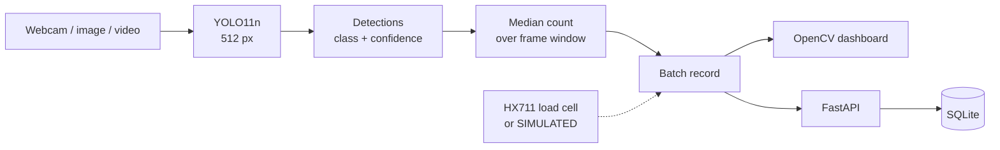

# Aurum

**Real-time computer vision that identifies and counts e-waste components from a webcam, and turns each session into a structured batch record.**

E-waste changes hands by gross weight, so what is actually inside a board is
invisible at the point of collection. Aurum's vision layer makes it
machine-readable: point a camera at a pile of hardware and get back *what is
there and how much of it*, as JSON the rest of a recycling workflow can use.

    

---

## What it does

```
Webcam / image / video
        ↓
YOLO11n detector  (fine-tuned, 512 px inference)
        ↓
Component detections  — class + confidence + box
        ↓
Median count over a frame window
        ↓
Batch record  →  OpenCV dashboard · FastAPI · SQLite
```

It identifies four component classes, counts them, and emits a batch record. It
does **not** measure precious-metal content — see [Limitations](#limitations).

## Demo


*Live webcam inference. Left: camera feed with detections. Right: per-class
counts, object total, mean confidence, batch ID, and mass (flagged **SIMULATED
SENSOR** when no load cell is attached). Bottom: model version, FPS, status.*

```bash
python run_demo.py          # webcam; falls back to image mode if no camera
```

Keys: `B` new batch · `S` save batch · `SPACE` pause · `Q` quit

## Results

| Metric | Result |
| --- | ---: |
| Test mAP@50 | **0.742** |
| Test mAP@50:95 | **0.471** |
| Test precision | **0.731** |
| Test recall | **0.724** |
| Live inference | **56.8 FPS** (1280×720 capture, 512 px inference, Apple M4) |
| Classes | 4 |
| Tests | 92 passing |

Per class, on 206 unseen images:

| Class | Instances | mAP@50 | mAP@50:95 |
| --- | ---: | ---: | ---: |
| CPU | 79 | 0.956 | 0.710 |
| PCB | 69 | 0.812 | 0.446 |
| RAM | 139 | 0.628 | 0.310 |
| Connector | 53 | 0.572 | 0.420 |


**Read these with the external result below.** On 28 photographs from a
different source, the model fires on only 29% of images and detects **zero**
CPUs — despite CPU being its strongest test class. Same-provenance test scores
measure generalization across photographs, not across the world.

Measured on a held-out test split that shares **no duplicate cluster** with
training data — verified: 0 clusters spanning splits, 0 exact duplicates, 0
near-duplicates. Full methodology and the external probe:
[docs/evaluation.md](docs/evaluation.md).

## Supported components

| Class | What counts as one |
|---|---|
| **PCB** | A whole board as one object — motherboards, expansion cards, bare or populated |
| **RAM** | A memory module — DIMM, SO-DIMM, RDIMM |
| **CPU** | A packaged processor — LGA, PGA or BGA, lid or pin side |
| **Connector** | A mating interface — headers, sockets, slots, edge connectors, rear port banks |

Four classes, not forty. Classes without enough reliable annotation were dropped
rather than shipped weak — including `gpu`, the single largest available label,
because in the source data a GPU is a shrouded card whose camera-facing surface
is a cooler shroud rather than an exposed board. Reasoning in
[docs/dataset.md](docs/dataset.md).

## Dataset

Six public [Roboflow Universe](https://universe.roboflow.com) datasets — 17,193
images under **CC BY 4.0** and **Public Domain** — normalized into the four
Aurum classes via an explicit label map where every source label is either
mapped or dropped with a written reason.

The split is the part worth scrutinising. Source datasets ship augmented copies
of one photograph as separate files, and the same photo appears across multiple
projects. Splitting at random would put rotations of the same RAM module in both
train and test. So images are grouped into **duplicate clusters** (source stem,
then SHA-256 and perceptual hash across datasets) and **clusters, not images,
are split 70/20/10**.

`python -m ml.validate` re-checks this independently and exits non-zero if any
photograph reaches the test set from training. It is not decoration — it caught
18 near-duplicates that the first version of the grouping code missed.

Per-dataset counts, licenses and attributions: [docs/dataset.md](docs/dataset.md).

## Architecture



| Piece | Role |
|---|---|
| **Ultralytics YOLO11n** | Detection. Nano variant for real-time laptop inference; fine-tuned from COCO weights |
| **OpenCV** | Capture and dashboard rendering — the demo is one process, no browser, no server |
| **FastAPI** | HTTP surface for the rest of the stack |
| **SQLite** | Batch ledger, persists offline at the point of collection |

More detail: [docs/architecture.md](docs/architecture.md).

## Installation

Prerequisites: **Python 3.12** (PyTorch has no stable 3.14 wheels), a webcam for
the live demo, and ~1 GB disk if you rebuild the dataset.

```bash
git clone https://github.com/parth-sharma-10/aurum.git
cd aurum

python3.12 -m venv .venv
source .venv/bin/activate          # Windows: .venv\Scripts\activate
pip install -r requirements.txt
```

**Model weights.** Weights are not committed (they are build artifacts derived
from CC BY 4.0 data). Either train them — about 3 hours on an Apple M4 —

```bash
cp env.example .env                # add your free Roboflow API key
export ROBOFLOW_API_KEY="..."      # or: set -a; source .env; set +a
python -m ml.ingest                # download the 6 source datasets
python -m ml.prepare               # normalize, deduplicate, split
python -m ml.validate              # prove the split is leak-free
python -m ml.train                 # fine-tune YOLO11n
```

— or drop an existing `aurum_vision_v0_1_best.pt` into `models/`.

No environment variable is needed to *run* the demo or API against existing
weights. `env.example` documents every variable; copy it to `.env` (gitignored)
if you prefer a file.

macOS: grant your terminal camera permission in **System Settings → Privacy &
Security → Camera** before the first webcam run.

## Usage

```bash
# Live webcam dashboard
python run_demo.py

# Image folder (no camera needed)
python run_demo.py --mode images --path data/aurum/test/images

# API — docs at http://127.0.0.1:8000/docs
uvicorn app.api:app --port 8000
curl -F "file=@board.jpg" http://127.0.0.1:8000/detect

# Train and evaluate
python -m ml.train
python scripts/watch_training.py    # live progress, in a second terminal
python -m ml.evaluate

# Tests (needs the dev extras)
pip install -r requirements-dev.txt
python -m pytest -q
ruff check . && ruff format --check .
```

### Batch record

```json
{
  "batch_id": "AUR-559179A3",
  "detections": { "PCB": 2, "RAM": 1, "CPU": 1, "Connector": 0 },
  "total_objects": 4,
  "average_confidence": 0.934,
  "counting_method": "median per-class count over a trailing 45-frame window",
  "model_version": "Aurum Vision v0.1",
  "weight": { "kg": 1.841, "simulated": true,
              "warning": "SIMULATED SENSOR — not a physical measurement" },
  "recovery_estimate": { "available": false, "reason": "No reference yield data loaded." }
}
```

Counts are the **median** over a trailing frame window, not whatever the last
frame said — otherwise the record would depend on when the operator clicked.

## Project structure

```
app/         Runtime: detector, dashboard, demo loop, batch logic, weight, API
ml/          Pipeline: ingest → prepare → validate → train → evaluate → assets
configs/     Label map, pinned datasets, recovery reference (disabled)
scripts/     Doc generators and the external evaluation fetcher
tests/       92 tests
docs/        dataset · training · evaluation · model-card · architecture · demo
reports/     Generated metrics, figures and validation output
run_demo.py  One-command demo entry point
```

Key files: `configs/aurum_labels.yaml` (every label decision, with reasons),
`ml/prepare.py` (the leakage-safe split), `app/batch.py` (batch composition and
the recovery-estimate guard).

## Documentation

| Document | What it covers |
| --- | --- |
| [docs/model-card.md](docs/model-card.md) | Intended use, measured results, failure modes, recovery-estimation status |
| [docs/evaluation.md](docs/evaluation.md) | Split design, leakage prevention, test and external results |
| [docs/dataset.md](docs/dataset.md) | Every source dataset, license, label mapping and exclusion reason |
| [docs/training.md](docs/training.md) | Reproducing the model end to end |
| [docs/architecture.md](docs/architecture.md) | How the runtime pieces fit together |
| [docs/demo.md](docs/demo.md) | Presentation runbook — setup, sequence, failure recovery, Q&A |

`model-card.md`, `evaluation.md` and `dataset.md` are **generated** from the
pipeline's own JSON output, so they cannot drift from the data they describe.
CI verifies that when the metrics file is removed they report results as
pending rather than emitting a placeholder figure.

## Evaluation methodology

Four datasets are kept strictly apart, because conflating them is how detection
results get oversold:

| | Provenance | Ground truth | Role |
|---|---|---|---|
| train | Roboflow Universe | yes | fits the weights |
| validation | Roboflow Universe | yes | selects the checkpoint |
| **test** | Roboflow Universe | yes | **the headline metric** |
| external | Wikimedia Commons | **no** | detection behaviour only |

The external set is 27 CC-licensed photographs from a different source,
verified by perceptual hash to have zero overlap with training. Those images
carry no annotations, so **no accuracy figure can be computed from them** and
none is quoted. See [docs/evaluation.md](docs/evaluation.md).

## Limitations

- **No composition sensing.** The model sees surfaces. It cannot tell a
  gold-plated connector from a tin-plated one of the same shape, and it does not
  determine composition, purity or recoverable value. Component detection is a
  *precursor* to valuation, not a substitute for assay.
- **Recovery estimation is disabled.** The mechanism (counts × reference yield ×
  spot price) is implemented but ships off, because the per-component yield
  figures it needs must be citable and none were available. It fails closed:
  no numeric field is emitted at all. See
  [docs/model-card.md](docs/model-card.md#recovery-estimation).
- **Dataset bias, and it is measured, not hypothetical.** Training images are
  internet photography of PC hardware — product shots, build photos, teardowns.
  On 28 photographs from a genuinely different source the model detects
  something in only 29% of images, and finds **zero CPUs** despite CPU scoring
  0.956 mAP@50 on the held-out test set. Closing that gap needs images
  collected on a real bench; no amount of threshold tuning substitutes for it.
  Run `python -m ml.realworld --path <your photos>` to measure it on yours.
- **Two weak classes.** `Connector` is deliberately broad (DIMM socket to RC
  plug) and scores 0.572 mAP@50. `RAM` scores 0.628 despite having the *most*
  training data — memory modules are commonly photographed in rows, and
  adjacent near-identical objects are hard to separate into distinct counts.
- **Counting is per-frame detection, not tracking.** Stacked or occluding boards
  can undercount; the median window suppresses flicker, not occlusion.
- **Small test set.** Per-class figures rest on tens of instances. Treat
  differences of a few points as noise.
- **Prototype.** Not production-ready, not industrial-grade sorting. No claim is
  made about sustained field accuracy or throughput.

## Roadmap

Realistic next steps, none of which are implemented:

- Collect and annotate images on an actual collection bench to close the domain
  gap the external evaluation exposes.
- Object tracking across frames so counts survive occlusion.
- Populate `configs/recovery_reference.yaml` with cited yield figures and enable
  recovery estimation behind the existing guard.
- Wire the HX711 load-cell path to real hardware (the serial backend exists and
  is untested against a physical cell).

## License and attribution

Code is **MIT** — see [LICENSE](LICENSE).

Not covered by that license:

- **Datasets** — third-party works from Roboflow Universe under CC BY 4.0 and
  Public Domain, not redistributed here; `python -m ml.ingest` fetches them from
  source. Per-dataset attribution: [docs/dataset.md](docs/dataset.md).
- **External evaluation images** — CC BY / CC BY-SA / CC0 / Public Domain from
  Wikimedia Commons; per-file license and author in
  `reports/realworld_sources.json`.
- **Ultralytics YOLO11** — **AGPL-3.0**. This project depends on it but does not
  vendor it. Review AGPL obligations before distributing a combined or hosted
  work, or obtain an Ultralytics commercial license.
