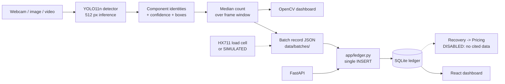

# Architecture

Aurum Vision is one sensing layer of the wider Project Aurum workflow. Its job
is narrow on purpose: turn what is physically on the bench into a machine-
readable record that later stages (valuation, sorting, EPR ledger) can consume.

## Runtime pipeline



**Both save paths meet at `app/ledger.py`.** The demo's `S` key and
`POST /batch/{id}/close` call the same `save()`, so a batch saved on stage
appears in `/batches`, `/stats` and the React dashboard. There is one `INSERT`
in the codebase and a test fails if a second appears.

The dotted branch is built but inert: `app/batch.recovery_estimate` and
`app/pricing.value_recovery` return explicit refusals until
`configs/recovery_reference.yaml` and `configs/price_reference.yaml` are given
cited figures.

The dashed line matters: mass is optional and, when no load cell is attached,
the reading is flagged `simulated: true` and rendered as **SIMULATED SENSOR**.
It is never presented as a measurement.

## Components and why each is there

| Piece | Role | Why this choice |
|---|---|---|
| **Ultralytics YOLO11n** | Object detection | Nano variant runs real-time on a laptop CPU/GPU. Fine-tuned from COCO weights; nothing trains from scratch. |
| **OpenCV** | Capture + dashboard rendering | The demo is one process with no browser and no server. A web UI adds two failure modes that kill live presentations. |
| **FastAPI** | HTTP surface for the rest of the stack | The seam where the Aurum backend consumes identifications and batch records. |
| **SQLite** | Batch ledger | Persists offline at the point of collection, which is the field constraint the concept doc calls out. Written by the API only. |
| **React + Vite** | Browser view of the ledger | Reads `/stats` and `/batches` over HTTP and computes nothing of its own. Not a live camera view. |

## Module map

```
app/
  detector.py    Model wrapper. Loading, warm-up, FPS accounting — shared by
                 the demo and the API so both report the same numbers.
  dashboard.py   Pure rendering. Takes detections + counts, returns a frame.
  demo.py        Frame sources (webcam / video / images) and the key loop.
  batch.py       Batch composition + the recovery-estimate guard.
  weight.py      HX711 backend, or a clearly-labelled simulation.
  ledger.py      Every read and write of the SQLite store. One INSERT.
  pricing.py     Price providers and estimated_quantity x price. Disabled by
                 default; no price data ships.
  api.py         FastAPI endpoints. Holds no SQL of its own.

frontend/
  src/App.jsx    Header, metric row, ledger table, batch-record modal.
  src/index.css  Design tokens, panels, badges, ledger table. The palette is
                 converted from the BGR constants in app/dashboard.py so the
                 browser and OpenCV views stay one instrument.

ml/
  ingest.py      Download pinned Roboflow datasets, record their metadata.
  labels.py      Source label -> Aurum class. Unreviewed labels raise.
  prepare.py     Normalize, cluster duplicates, split by cluster.
  validate.py    Independent leakage + integrity check. Gates training.
  train.py       Transfer learning from COCO-pretrained YOLO11.
  evaluate.py    Held-out metrics, confusion matrix, correct/failure examples.
  realworld.py   Inference over external images with no ground truth.
  assets.py      Figures, all generated from real pipeline output.
```

## Two design decisions worth explaining

**Counts are a median over a trailing frame window, not the last frame.**
Per-frame detection flickers — a hand crosses the bench and a module drops out
for two frames. If the batch record used whatever the last frame said, the
record would be a function of *when the operator clicked*. The median ignores
brief dropouts and brief double-counts without inventing anything. This is
unit-tested (`tests/test_batch.py`), including the case where the operator stops
on a bad frame.

**Splits are assigned over duplicate clusters, not images.** Source datasets
ship augmented copies of one photograph as separate files, and the same photo
appears across multiple Universe projects. Splitting those at random puts
rotations of the same RAM module in both train and test. See
[evaluation.md](evaluation.md) for the mechanism and the verification.

## Where the boundary is

Aurum Vision stops at identification. There is no endpoint that returns a metal
content, because the model does not produce one. Recovery estimation is a
separate, currently **disabled** mechanism — see
[model-card.md](model-card.md#recovery-estimation) and
`configs/recovery_reference.yaml`.
