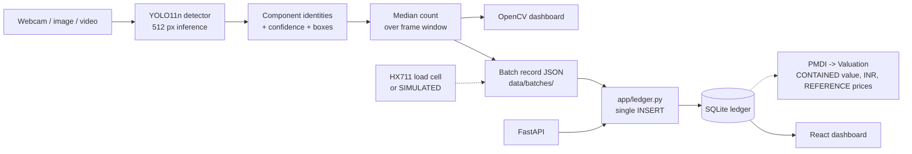

# Architecture

Aurum Vision is one sensing layer of the wider Project Aurum workflow. Its job
is narrow on purpose: turn what is physically on the bench into a machine-
readable record that later stages (valuation, sorting, EPR ledger) can consume.

## Runtime pipeline



**Both save paths meet at `app/ledger.py`.** The demo's `S` key and
`POST /batch/{id}/close` call the same `save()`, so a batch saved on stage
appears in `/batches`, `/stats` and the React dashboard. There is one `INSERT`
in the codebase and a test fails if a second appears.

The dotted branch computes what it can and refuses the rest. `app/valuation/`
produces PMDI, the price-independent `precious_mass_fraction_ppm`, and a
CONTAINED value in rupees, all from cited evidence.

`configs/pricing.yaml` ships `provider: reference`: a dated snapshot of real
published prices (IBJA, MCX, Kitco, with ECB for the FX), every quote stamped
`REFERENCE`. That status means one thing — a real price, published on a stated
date, being read as such. It is never `LIVE`, and it is never downgraded to
`STALE` either, because age is not a defect in a snapshot; `STALE` keeps its one
meaning of a live feed that went quiet. No live provider ships because no
keyless market-data source exists; `FallbackProvider` composes LIVE → REFERENCE
for the day one is configured.

What the valuation will **not** produce is a recoverable value. No cited
recovery factor was measured on a component as Aurum detects it, so
`recoverable_value` is a refusal carrying that reason rather than a number or a
zero. Contained, recoverable and scrap value are three different quantities and
the code names all three even though only one has a figure.

PMDI is an **input to** the A/B/C decision policy, never the same thing as it.
`app/valuation/` contains no grading logic and a test fails if it ever does.
See [pmdi.md](pmdi.md).

The dashed line matters: mass is optional and, when no load cell is attached,
the reading is flagged `simulated: true` and rendered as **SIMULATED SENSOR**.
It is never presented as a measurement.

## Components and why each is there

| Piece | Role | Why this choice |
|---|---|---|
| **Ultralytics YOLO11n** | Object detection | Nano variant runs real-time on a laptop CPU/GPU. Fine-tuned from COCO weights; nothing trains from scratch. |
| **OpenCV** | Capture + dashboard rendering | The demo is one process with no browser and no server. A web UI adds two failure modes that kill live presentations. |
| **FastAPI** | HTTP surface for the rest of the stack | The seam where the Aurum backend consumes identifications and batch records. |
| **SQLite** | Batch ledger | Persists offline at the point of collection, which is the field constraint the concept doc calls out. Written by the API only. |
| **React + Vite** | Browser view of the ledger | Reads `/stats` and `/batches` over HTTP and computes nothing of its own. Not a live camera view. |

## Valuation subsystem

| File | Role |
|---|---|
| `app/valuation/prices.py` | Providers (reference / unavailable / static / fallback), status model, staleness, unit **and currency** conversion |
| `app/valuation/pmdi.py` | The PMDI calculation; precious / base / other split |
| `app/valuation/valuation.py` | PMDI plus the separate base-metal signal, packaged for audit |
| `app/config.py` | Every threshold and physical constant, `defaults -> YAML -> environment` |

## Mass measurement

```
HX711 -> Arduino (raw counts) -> serial -> median filter -> stability window
      -> calibration -> WeightStatus -> the item's existing AUR-ITEM- identity
```

| File | Role |
|---|---|
| `app/weight.py` | Protocol parsing, calibration record, filter, stability, `WeightSensor` |
| `app/calibrate.py` | The two-mass calibration workflow |
| `hardware/arduino/aurum_weight/` | Weight-only sketch. No servo code. |
| `configs/calibration.yaml` | The measured factor. **Ships UNMEASURED.** |

The Arduino sends **raw counts**; Python owns the calibration, so the factor
lives in version control next to the workflow that produced it and the second
known mass that verified it. Only a `MEASURED` reading -- settled, on a
*verified* calibration, from real hardware -- may drive a concentration-based
metal estimate. Everything else routes to Bin C.

Full wiring, protocol and validation status: [hardware.md](hardware.md).

## Item identity and lifecycle

```
frame -> detector -> ByteTrack -> TrackedItem -> ASSEMBLY (stable item_id)
      -> weight -> PMDI -> decision -> routing
```

A camera pointed at the bench produces a CPU in frame 1, a CPU in frame 2 and a
CPU in frame 3. That is **one** physical object, and everything downstream --
one weighing, one decision, one servo firing, one ledger row -- depends on
saying so.

It also produces, for a motherboard, a PCB *and* two RAM modules *and* a CPU
*and* five connectors, all in the same frame. That too is **one** physical
object: one thing a hand picks up, one thing the pan weighs, one mass.
`app/vision/assembly.py` decides which detected components are one object, by
spatial containment -- a component whose box lies inside a container's box is
on it. No rule anywhere describes a motherboard; a board with four modules, one
or none groups by exactly the same test, and a class becomes a container by
being listed in `tracking.assembly.container_classes`.

The assembly id **is** the physical item id. A standalone component is an
assembly of one and keeps its own `AUR-ITEM-`, so nothing downstream has to
know whether it is holding a board or a bare chip.

| File | Role |
|---|---|
| `app/vision/tracker.py` | `ItemTracker`, the lifecycle state machine; `DetectorTracker`, the ByteTrack adapter |
| `app/vision/assembly.py` | `Assembly`, and `group()` -- tracked items to physical objects by containment |
| `app/pipeline/item_pipeline.py` | Composes detector, tracker and lifecycle; the seam later phases hang off |
| `app/pipeline/association.py` | `SingleObjectZone` -- which object is on the pan, and the latch that keeps its identity once it leaves the camera |
| `app/pipeline/pan.py` | `PanMachine` -- the automatic weighing cycle |
| `configs/tracking.yaml` | Track-loss tolerance, confirmation threshold, assembly containment |

### The automatic cycle

```
WAITING_FOR_OBJECT -> OBJECT_PRESENT -> WEIGHING -> WEIGHT_STABLE
    -> PROCESSING -> ROUTING -> WAITING_FOR_CLEAR -> WAITING_FOR_OBJECT
```

The load cell drives it; there is no button in the normal path. `pan.py` adds
only the two things `WeightSensor` has no opinion about -- has something
arrived, and has it gone -- and delegates every stability judgement to the
existing sensor. Arrival and clearance thresholds are
`conveyor.weight.pan.*`; stability stays `conveyor.weight.stability_*`.

Two rules keep it honest. Crossing the arrival threshold **opens** a cycle and
never ends one, so the first non-zero reading is never what gets recorded. And
every failure -- a mass that will not settle, a pulled USB cable, a mass with no
confirmed identity -- completes the cycle and returns the machine to waiting,
because a machine that needs rescuing after a wobble is not automatic.

It runs on its own thread. `WeightSensor.read()` blocks until the mass settles
and `ArduinoController.move()` blocks until the board acknowledges a *completed*
stroke, and neither may run on the camera thread or hold the session lock while
it waits.

### Assembly mass and double counting

An assembly has one mass covering every component on it. A per-kilogram figure
for the board therefore may **not** be multiplied by it -- that would count the
processor's and the modules' mass as board material. `app/materials.py` refuses
the concentration line instead and reports the refusal, which is why a
motherboard yields `completeness: PARTIAL_ESTIMATE` with `valued` and
`not_valued` naming exactly what the figure does and does not cover.

Completeness is reported, never acted on: no bin follows from it. How much of
an object the evidence covers and which bin it belongs in are different
questions, and any policy joining them belongs in `configs/grading.yaml`.

### A `track_id` is not an `item_id`

**These are deliberately different things.** ByteTrack numbers tracks from 1 and
starts over every process, so using its number as the ledger identity would
collide across restarts -- two different CPUs from two different sessions both
filed as item 1. Aurum mints `AUR-ITEM-xxxxxxxx` and carries the `track_id`
alongside it for debugging only.

A track id recycled by the tracker after an item has finalized produces a **new**
item identity, never a revived one.

### Lifecycle

```
NEW  ->  TRACKING  ->  CONFIRMED  ->  LEAVING  ->  FINALIZED
```

| State | Meaning |
|---|---|
| `NEW` | Seen once. Not yet something to act on. |
| `TRACKING` | Seen repeatedly, below the confirmation threshold. |
| `CONFIRMED` | Eligible to be weighed, decided and routed. |
| `LEAVING` | Missing from recent frames, still inside tolerance. May return. |
| `FINALIZED` | Terminal. Handed over exactly once. |

There is no `MEASURING` state: nothing drives one yet. Phase 5 attaches a mass
to an item while it is `CONFIRMED`, through the `weight_g` / `weight_status` /
`weight_timestamp` slots the model already carries.

**An item is not finalized because it blinked.** A detection miss or an
occluded frame moves it to `LEAVING`; only
`tracking.max_missing_frames` consecutive absences finalize it. Finalization is
idempotent, and `drain_finalized()` hands each item over exactly once -- that is
what stops one physical component becoming several ledger rows.

### Confidence has one documented meaning

`TrackedItem.confidence` is the **mean over every observation**, and that is the
figure the decision engine reads. A single lucky frame must not promote an item
into the premium bin, nor a single unlucky one demote it. `latest_confidence`
and `max_confidence` are also exposed, and the output states which basis was
used.

The majority class over all observations wins, so a one-frame class flip cannot
change which bin an item is routed to.

### Engineering approximations

| Setting | Value | Source |
|---|---|---|
| `tracking.max_missing_frames` | 15 (~0.5 s at 30 fps) | **none -- engineering approximation** |
| `tracking.min_detections_to_confirm` | 3 | **none -- engineering approximation** |

Velocity is reported in **pixels per frame** and deliberately not converted to
cm/s: that needs a belt speed and a pixel scale, both `UNMEASURED`.

## Actuation boundary (Phase 7, PARTIAL)

```
A/B/C decision -> routing scheduler -> ScheduledRoute -> DUE
                -> Arduino command -> ACK -> Servo A / Servo B
C -> NO_ACTION -> no command is ever sent
```

Four words that are not synonyms:

| | Meaning |
|---|---|
| **decision** | Policy chose Bin A |
| **route** | Geometry chose Servo A at a particular moment |
| **command** | Software asked the board to move |
| **execution** | The board acknowledged |

**An ACK is not proof a servo moved.** A stalled servo, a disconnected signal
wire or a dead supply rail all still ACK. Physical movement is established by
bench observation and recorded in [hardware.md](hardware.md).

| File | Role | State |
|---|---|---|
| `app/hardware/transport.py` | Serial boundary; `SerialTransport`, `FakeTransport` | Implemented |
| `app/hardware/arduino.py` | Protocol, command lifecycle, ACK, duplicates | Implemented |
| `app/hardware/servos.py` | Scheduler-to-actuator bridge | **NOT WRITTEN** |

Nothing above `app/hardware/` imports pyserial. Actuation ships **off**
(`conveyor.arduino.enabled: false`).

## Routing

```
decision (A/B/C) -> routing feasibility -> scheduled action -> [Phase 7] servo
```

| File | Role |
|---|---|
| `app/routing/geometry.py` | Physical constants and the travel-time arithmetic |
| `app/routing/scheduler.py` | The queue, the reason codes, the `ScheduledRoute` record |
| `configs/conveyor.yaml` | Real geometry (UNMEASURED) and the TEST demonstration profile |

### The timing model

```
travel_s   = distance_cm / belt_speed_cm_s
execute_at = detected_at
           + travel_s                        when the item arrives
           - servo_actuation_delay_ms / 1000  send early: the paddle takes time
           + timing_offset_ms / 1000          the calibration knob
```

The actuation delay is **subtracted** because it is time the servo spends
moving: to have the paddle in the stream at arrival, the command must leave
before arrival. It is a separate parameter from the distance and is never
folded into it.

**Sign convention:** negative `timing_offset_ms` fires **earlier**, positive
fires **later**.

Distances are measured from the camera's field-of-view centre, along the belt.
A caller who has measured a pixel-to-centimetre scale may pass
`position_offset_cm` per item; the prototype does not, because that scale is
UNMEASURED.

### Three things that are not the same

| | |
|---|---|
| **Decision** | The evidence and policy justify bin A. |
| **Routability** | The machine can currently put it there. |
| **Actuation** | A paddle physically moved. |

An unmeasured belt makes an item unroutable while leaving its decision exactly
as it was. The scheduler **never** rewrites an A into a C to express "I could
not schedule it": the record keeps `decision: A`, `target: A`,
`status: UNSCHEDULED`, `reason_code: BELT_SPEED_UNMEASURED`.

Nothing in `app/routing/` opens a serial port or moves a servo. A test asserts
the package contains no serial vocabulary at all.

### Bin C

`decision = C` produces `status: NO_ACTION`, `servo: None`. There is no Servo
C and none is invented. C needs no geometry, so it resolves even on a
completely unmeasured machine — the fail-safe is the machine doing nothing,
which is also what happens if this software crashes.

### Failure modes

| Reason code | When |
|---|---|
| `BELT_SPEED_UNMEASURED` | Speed is UNMEASURED, zero or negative |
| `SERVO_GEOMETRY_UNMEASURED` | The distance this route needs is missing or negative |
| `ACTUATION_DELAY_UNMEASURED` | The paddle delay was never timed |
| `TIMING_EXPIRED` | The firing moment already passed. **Never fires late to catch up** — the item has gone, and a catch-up strikes whatever is behind it |
| `TIMING_UNAVAILABLE` | The detection time is not a finite number |
| `INVALID_POSITION` | A position offset is unusable, or puts the item past the servo |
| `INVALID_DECISION` | The decision names no valid bin |
| `ALREADY_ROUTED` | One physical item gets one physical routing action |
| `STALE_ITEM` | The item lifecycle has never heard of this identity |

### Demonstration mode

The physical conveyor does not exist. `configs/conveyor.yaml` carries a
`simulation:` block of **TEST** values, reachable *only* when
`conveyor.runtime.simulation` is true. Every result computed from them is
stamped `mode: SIMULATED`, and a test asserts the production geometry ships
UNMEASURED so TEST distances cannot quietly become real ones.

Belt speed is a **configured constant, an engineering approximation**. This
machine has no encoder, so nothing here measures conveyor velocity.

## Decision policy

| File | Role |
|---|---|
| `app/decision/engine.py` | The A/B/C ladder, reason codes, and the explainable `Decision` record |
| `configs/grading.yaml` | Thresholds and the class-aware policy |

```
material evidence -> PMDI / valuation -> DECISION POLICY -> A / B / C -> routing (Phase 6)
```

The three are separate on purpose. PMDI says what the evidence implies
economically; the decision engine says what the machine does about it; routing
translates a bin into a servo firing. Nothing in `app/decision/` changes a cited
or measured quantity, and no class name or threshold appears in its logic --
both come from configuration.

**Bin C is the fail-safe and has no servo.** An item nobody routes reaches the
end of the belt and falls into C, so every refusal is also the safe hardware
state. See [pmdi.md](pmdi.md) for the ladder and the reason codes.

Grading thresholds in `configs/grading.yaml` are **configurable engineering
approximations** for the prototype, not validated scientific cutoffs. The
`preferred_classes` mechanism is an engineering sorting policy and says so at
the point of use.

## Module map

```
app/
  detector.py    Model wrapper. Loading, warm-up, FPS accounting — shared by
                 the demo and the API so both report the same numbers.
  dashboard.py   Pure rendering. Takes detections + counts, returns a frame.
  demo.py        Frame sources (webcam / video / images) and the key loop.
  batch.py       Batch composition + the recovery-estimate guard.
  weight.py      HX711 backend, or a clearly-labelled simulation.
  ledger.py      Every read and write of the SQLite store. One INSERT.
  pricing.py     SUPERSEDED by app/valuation/prices.py; still serving the batch
                 endpoints. Declines a multi-currency snapshot rather than
                 half-pricing it - it matches units exactly and cannot convert
                 currencies, so it would emit a gold-only figure labelled as a
                 total.
  api.py         FastAPI endpoints. Holds no SQL of its own.

frontend/
  src/App.jsx    Header, metric row, ledger table, batch-record modal.
  src/index.css  Design tokens, panels, badges, ledger table. The palette is
                 converted from the BGR constants in app/dashboard.py so the
                 browser and OpenCV views stay one instrument.

ml/
  ingest.py      Download pinned Roboflow datasets, record their metadata.
  labels.py      Source label -> Aurum class. Unreviewed labels raise.
  prepare.py     Normalize, cluster duplicates, split by cluster.
  validate.py    Independent leakage + integrity check. Gates training.
  train.py       Transfer learning from COCO-pretrained YOLO11.
  evaluate.py    Held-out metrics, confusion matrix, correct/failure examples.
  realworld.py   Inference over external images with no ground truth.
  assets.py      Figures, all generated from real pipeline output.
```

## Two design decisions worth explaining

**Counts are a median over a trailing frame window, not the last frame.**
Per-frame detection flickers — a hand crosses the bench and a module drops out
for two frames. If the batch record used whatever the last frame said, the
record would be a function of *when the operator clicked*. The median ignores
brief dropouts and brief double-counts without inventing anything. This is
unit-tested (`tests/test_batch.py`), including the case where the operator stops
on a bad frame.

**Splits are assigned over duplicate clusters, not images.** Source datasets
ship augmented copies of one photograph as separate files, and the same photo
appears across multiple Universe projects. Splitting those at random puts
rotations of the same RAM module in both train and test. See
[evaluation.md](evaluation.md) for the mechanism and the verification.

## Where the boundary is

Aurum Vision stops at identification. There is no endpoint that returns a metal
content, because the model does not produce one. Recovery estimation is a
separate, currently **disabled** mechanism — see
[model-card.md](model-card.md#recovery-estimation) and
`configs/material_reference.yaml`.
